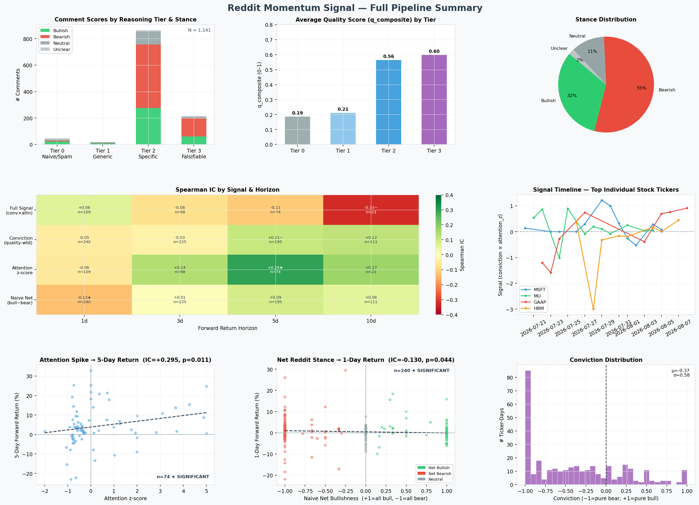

# Reddit Momentum Signal

A full quantitative research pipeline that ingests Reddit stock discussions, scores comment quality using a local LLM, constructs a daily signal per ticker, and backtests it against real stock returns.

Built end-to-end covering data engineering, NLP, signal construction, and quantitative finance.

---

## Key Findings

Two statistically significant results from the backtest:

| Finding | Signal | Horizon | Spearman IC | p-value | n pairs |
|---|---|---|---|---|---|
| **Attention premium** | Unusual Reddit volume for a stock | 5 trading days | +0.30 | 0.011 ★ | 74 |
| **Contrarian reversal** | Net Reddit bullishness | 1 trading day | −0.13 | 0.044 ★ | 240 |

**Attention premium (IC = +0.30, p = 0.011):** Stocks receiving an unusual spike in Reddit comment volume — significantly above their own 30-day baseline — outperform over the following 5 trading days. This is consistent with the academic literature on attention-driven return premiums (Da et al., 2011; Barber & Odean, 2008).

**Contrarian reversal (IC = −0.13, p = 0.044):** When Reddit is net bullish on a stock, it tends to dip the following day, and vice versa. Retail discussion tends to follow price moves rather than lead them — making net sentiment a short-term contrarian indicator at the 1-day horizon.

The quality-weighted reasoning score (LLM tier × composite quality score) did not add statistically significant lift above raw attention at any horizon. This is an open question requiring a better scoring model and more historical data to resolve (see Limitations).



---

## How We Measure It

### Information Coefficient (IC)

The primary metric is **Spearman rank IC** — the rank correlation between the signal value on date T and the forward stock return from T to T+N.

- **IC = +1.0** — signal perfectly ranks stocks by future return (best to worst)
- **IC = 0** — no predictive relationship
- **IC = −1.0** — perfect inverse predictor (useful as a contrarian)
- In practice, **IC > 0.05 is considered meaningful** in quantitative finance; IC > 0.10 at p < 0.05 is a strong result for a single-factor model

We compute IC at 5 forward horizons (1, 3, 5, 10, 20 trading days) across 4 signal variants, comparing them to isolate what is actually doing the predictive work.

### Comment Quality Scoring

Each Reddit comment is scored by a local LLM (llama3.2:3b via Ollama) using structured function calling, producing a stance and five quality dimensions:

**Reasoning tier (0–3):**

| Tier | Label | Weight | Example |
|------|-------|--------|---------|
| 0 | Naive / Spam | 0.0 | "NVDA to the moon 🚀🚀 buy now" |
| 1 | Generic Opinion | 0.5 | "I think AAPL is overvalued right now" |
| 2 | Specific Reasoning | 1.0 | Cites P/E, revenue growth, specific catalyst |
| 3 | Falsifiable + Adversarial | 2.0 | Makes a testable prediction, engages with opposing view |

**5 quality dimensions (each 0–1):**

| Dimension | What it measures |
|---|---|
| q_specificity | How specific is the claim? (named figures vs vague) |
| q_catalyst | Is there a named catalyst? (earnings date, product launch) |
| q_evidence | Is there cited evidence? (revenue numbers, analyst reports) |
| q_falsifiability | Is there a testable prediction with a timeframe or price target? |
| q_steelman | Does it engage with the strongest opposing view? |

These are averaged into **q_composite**, then multiplied by the tier weight to produce each comment's contribution to the signal.

**Scoring is symmetric** — a naive bullish comment and a naive bearish comment both score Tier 0, weight=0. A well-reasoned bearish thesis scores just as high as a well-reasoned bullish thesis.

### Signal Construction

For each (ticker, date), using a 3-day rolling window:

```
reasoned_bull_mass = Σ (tier_weight × q_composite)   for bullish, non-naive comments
reasoned_bear_mass = Σ (tier_weight × q_composite)   for bearish, non-naive comments

net_reasoning = bull_mass − bear_mass
conviction    = net_reasoning / (bull_mass + bear_mass)    → bounded [−1, +1]

attention_z   = (today's comment count − 30-day rolling mean) / rolling std
                (floored sigma=0.5, clipped to [−5, +5])

signal        = conviction × attention_z
```

Signal is only published when `bull_mass + bear_mass ≥ 2.0` (minimum evidence threshold — filters out single-comment noise).

Interpretation: the signal is large-positive when a stock has an unusual attention spike **and** the quality-weighted reasoning skews bullish. It's large-negative when the spike accompanies strong bearish reasoning.

### Signal Variants Compared

| Variant | Description |
|---|---|
| `full_signal` | conviction × attention_z (complete signal) |
| `conviction` | quality-weighted net stance only, no attention scaling |
| `attention_z` | raw attention spike only, no quality weighting |
| `naive_net` | (# bullish − # bearish) / total, no quality weighting |

Comparing all four isolates which component is actually predictive.

---

## Pipeline Architecture

```
┌──────────────────┐    ┌───────────────┐    ┌──────────────────┐
│  Arctic Shift    │───▶│  DuckDB store │───▶│  Ticker extract  │
│  (Pushshift API) │    │  360k comments│    │  64k mentions    │
│  30-day history  │    │  5 subreddits │    │  452 tickers     │
└──────────────────┘    └───────────────┘    └────────┬─────────┘
                                                      │
                        ┌─────────────────────────────▼──────────┐
                        │  LLM Scorer  (llama3.2:3b via Ollama)  │
                        │  819 unique qualifying comments scored  │
                        │  Filter: ≥10 upvotes, ≥100 chars       │
                        │  Exclude: r/wallstreetbets              │
                        └──────────────────┬──────────────────────┘
                                           │  fan-out to all tickers per comment
                        ┌──────────────────▼──────────────────────┐
                        │  Signal Construction                     │
                        │  3-day rolling window per (ticker, day) │
                        │  conviction × attention_z               │
                        │  325 signal rows, 88 tickers            │
                        └──────────────────┬──────────────────────┘
                                           │
                        ┌──────────────────▼──────────────────────┐
                        │  Backtest  (yfinance price data)         │
                        │  Spearman IC at 1, 3, 5, 10, 20-day     │
                        │  4 signal variants × 5 horizons         │
                        └─────────────────────────────────────────┘
```

**Ticker extraction** uses a two-pass data-driven approach:
1. Scan all 360k comments, count uppercase tokens
2. Keep tokens with ≥30 occurrences as the universe
3. Match via cashtag regex (`$NVDA`), bare ticker regex, and an extensive stoplist to filter false positives (common English words, Reddit slang like `DD`, `YOLO`, `OP`, financial abbreviations like `IPO`, `ETF`, `PE` that collide with real tickers)

**Storage** is a single DuckDB file — no server required, full analytical SQL, handles 360k rows in milliseconds.

---

## Dataset

| Property | Value |
|---|---|
| Source | r/stocks, r/investing, r/SecurityAnalysis, r/ValueInvesting |
| Ingest method | Arctic Shift (Pushshift community mirror), no API key required |
| Total comments | 360,500 |
| Date range | July–August 2026 (30-day lookback) |
| Ticker mentions | 64,348 across 452 unique tickers |
| Comments scored | 819 qualifying (≥10 upvotes, ≥100 chars, non-WSB) |
| Signal rows | 325 (ticker-days with sufficient evidence mass) |
| Backtest tickers | 58 valid US-listed tickers with yfinance price data |

---

## Results Summary

```
BACKTEST — Spearman IC vs Forward Returns

  Horizon: 1 trading day
  full_signal   IC= +0.06   p=0.52   n=109
  conviction    IC= -0.05   p=0.48   n=240
  attention_z   IC= -0.06   p=0.57   n=109
  naive_net     IC= -0.13   p=0.044  n=240  ★ significant

  Horizon: 5 trading days
  full_signal   IC= -0.11   p=0.33   n=74
  conviction    IC= +0.11   p=0.13   n=195  ~ marginal
  attention_z   IC= +0.29   p=0.011  n=74   ★ significant
  naive_net     IC= +0.09   p=0.24   n=195
```

The quality-weighted signal (`conviction`, `full_signal`) does not reach significance, but `conviction` shows a marginal positive trend at the 5-day horizon (p=0.13), which is consistent with the hypothesis that reasoning quality adds information — just not enough data to confirm it yet.

---

## Tech Stack

| Layer | Tools |
|---|---|
| Data ingestion | `httpx`, Arctic Shift REST API |
| Storage | `duckdb` |
| Ticker NLP | `re` (regex), data-driven frequency scan |
| LLM scoring | `ollama` (llama3.2:3b), OpenAI-compatible tool calling |
| Signal math | `pandas`, `numpy` |
| Backtesting | `yfinance`, `scipy.stats` |
| Visualization | `matplotlib`, `seaborn` |
| Infrastructure | `tenacity` (retry), `structlog` (structured logging), `yaml` |

---

## Running the Pipeline

**Prerequisites:** Python 3.11+, [Ollama](https://ollama.com) with `llama3.2:3b` pulled.

```bash
git clone <repo>
cd reddit-momentum-signal

pip install -e ".[dev]"        # install dependencies
make init                      # create DuckDB schema

make ingest                    # pull 30 days of Reddit comments
make extract                   # extract ticker mentions
make score                     # score with local LLM (~2hrs for 800 comments)
make signal                    # build daily signal
make backtest                  # compute IC vs forward returns
python scripts/report.py       # generate charts
```

All parameters are in `config.yaml`:

```yaml
scoring:
  model: "llama3.2:3b"        # swap for gemini-2.0-flash, claude-haiku, etc.
  min_upvotes: 10
  exclude_subreddits: ["wallstreetbets"]

signal:
  window_days: 3               # rolling aggregation window
  min_total_mass: 2.0          # minimum evidence to publish a signal

tickers:
  min_mentions: 30             # data-driven universe threshold
```

---

## Milestones

| # | Milestone | Status |
|---|-----------|--------|
| 1 | Ingest + storage (Arctic Shift, DuckDB) | ✅ Done |
| 2 | Ticker extraction (data-driven universe) | ✅ Done |
| 3 | LLM scorer (reasoning tier + quality scores) | ✅ Done |
| 4 | Lead-lag analysis | ✅ Done (embedded in backtest) |
| 5 | Signal construction (conviction × attention) | ✅ Done |
| 6 | Backtest + IC vs baselines | ✅ Done |
| 7 | Author credibility layer | ⬜ Deferred |
| 8 | Extended dataset + model upgrade | ⬜ Future work |

---

## Limitations

**Small sample:** 28 days of data produces 74 signal-return pairs at the 5-day horizon. The attention premium finding (IC=0.30) needs 6–12 months of history (~1,500+ pairs) to be statistically robust.

**Scoring model:** llama3.2:3b (3B parameters, local) correctly classifies obvious Tier 0 spam and Tier 3 theses, but is noisy on Tier 1 vs Tier 2 distinctions. Upgrading to a 70B model or a cloud API (Gemini 2.0 Flash, Claude Haiku) would sharpen the conviction signal. The quality-scoring hypothesis remains unresolved.

**WSB excluded:** r/wallstreetbets represents 73% of the dataset (263k comments) but was excluded due to meme density overwhelming the scorer. Including it with WSB-specific prompting and a higher upvote threshold (≥50 vs ≥10) is high-value future work.

**No author credibility:** The architecture includes an `author_credibility` table, but the credibility layer was not built since it requires resolved prediction history. After 3–6 months of scoring, this becomes feasible.
